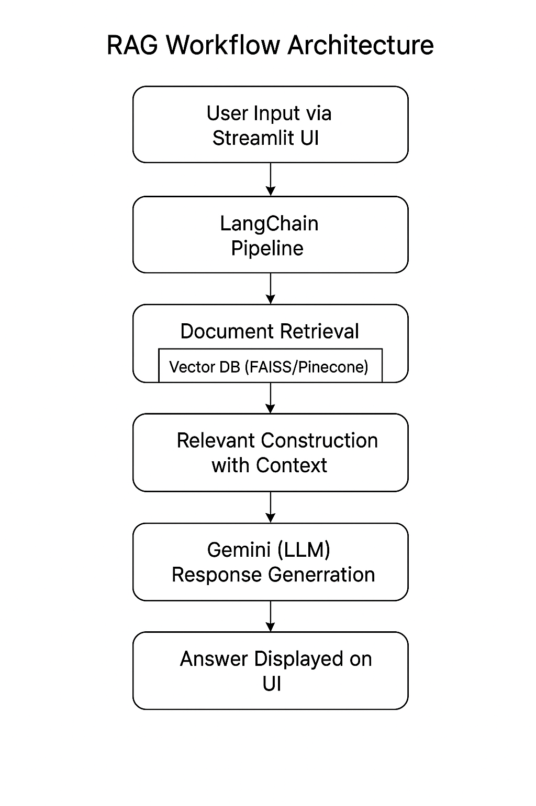

# 🧠 MedBot: RAG-Based End-to-End Medical Chatbot

A **Retrieval-Augmented Generation (RAG)** medical chatbot powered by **LangChain**, **Gemini API**, and **FAISS/Pinecone**, designed to provide accurate and context-rich answers from medical documents through a conversational UI built with **Streamlit**.

---

## 📋 Table of Contents

* [Overview](#-overview)
* [Key Features](#-key-features)
* [Architecture](#-architecture)
* [Prerequisites](#-prerequisites)
* [Quick Start](#-quick-start)
* [Example Queries](#-example-queries)
* [File Structure](#-file-structure)
* [Tech Stack](#-tech-stack)
* [Acknowledgments](#-acknowledgments)

---

## 🎯 Overview

**MedBot** is a domain-specific chatbot built on the RAG (Retrieval-Augmented Generation) framework. It retrieves relevant information from user-uploaded medical PDFs and augments queries with context before passing them to a language model for accurate, grounded responses.

---

## ✨ Key Features

* 🔍 **Document-Based Knowledge**: Upload medical PDFs to extract relevant answers.
* 🧠 **Gemini API Integration**: Powered by Google Gemini for intelligent language understanding.
* 🗂️ **Retrieval with FAISS or Pinecone**: Embeds and indexes document chunks for fast similarity search.
* 💬 **Chat Interface**: Built with Streamlit for seamless user experience.
* 🐳 **Docker-Ready**: Easy containerization for deployment.

---

## 🏗️ Architecture

### 📌 Flow

```
User Query → Streamlit UI → LangChain Pipeline → Vector DB (FAISS/Pinecone)
→ Relevant Chunks → Prompt Construction → Gemini LLM → Answer → Display on UI
```

### 🧩 RAG Workflow Architecture

This diagram illustrates the step-by-step flow of the RAG-based medical chatbot system using LangChain, vector DBs, and Gemini.



> *This flowchart shows how the chatbot processes queries with retrieval and generation components.*

---

## 📋 Prerequisites

* Python 3.8+
* Google Gemini API Key
* FAISS (for local use) or Pinecone account
* Streamlit
* Docker (optional)

---

## 🚀 Quick Start

### 1. Clone the Repository

```bash
git clone https://github.com/yourusername/medbot-rag.git
cd medbot-rag
```

### 2. Install Dependencies

```bash
pip install -r requirements.txt
```

### 3. Set Up Environment Variables

Create a `.env` file in the root:

```ini
# Gemini API
GEMINI_API_KEY=your_gemini_api_key

# Pinecone (optional)
PINECONE_API_KEY=your_pinecone_api_key
PINECONE_ENVIRONMENT=your_environment

# Embedding & LLM models
EMBEDDING_MODEL=text-embedding-ada-002
LLM_MODEL=gemini-pro
```

### 4. Embed Documents

```bash
python store_index.py
```

This will process your PDFs and store vector embeddings in FAISS or Pinecone.

### 5. Launch the App

```bash
streamlit run app.py
```

---

## 💬 Example Queries

* “What are the symptoms of pituitary tumors?”
* “List treatment methods for gliomas.”
* “Explain meningitis in simple terms.”

---

## 📂 File Structure

```
medbot-rag/
├── app.py                 # Streamlit UI
├── rag_pipeline.py        # LangChain logic
├── store_index.py         # Embedding & vector store setup
├── .env                   # API credentials
├── requirements.txt
└── README.md
```

---

## 🛠️ Tech Stack

| Tool       | Purpose                     |
| ---------- | --------------------------- |
| LangChain  | RAG pipeline orchestration  |
| Gemini API | Natural language generation |
| FAISS      | Local vector search         |
| Pinecone   | Optional scalable vector DB |
| Streamlit  | UI for user interaction     |
| Python     | Core programming language   |
| Docker     | Containerization (optional) |

---

## 🙌 Acknowledgments

* Built on the concepts of RAG from LangChain and Gemini documentation.
* Inspired by MedGraph-AI and LangChain vector search applications.

---

## 📢 Contributing

Pull requests are welcome. For major changes, please open an issue first to discuss what you’d like to change.
